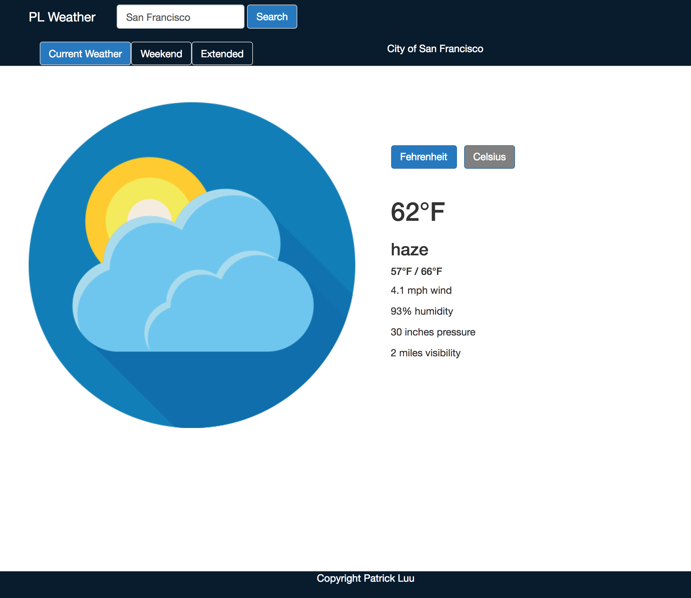
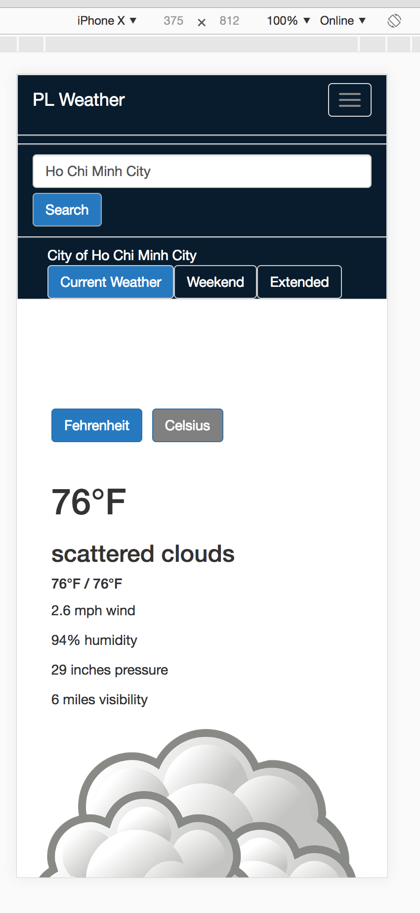

# PL Weather Forecast

### Group Members

Patrick Luu

### Purpose

The app allow user enter their location to get current weather forecast. The user can toggle between Fahrenheit and Celsius. I have used CSS for animation of button colors when user toggle between Fahrenheit and Celsius. For user-facing feature, I have add the interactive weather icon image base on the location weather condition. I have used React-Bootstrap and CSS for Nav Bar and search result. For request caching, I have used axios-cache-adapter to store data in memory for more optimization and quicker response time. I have implemented setState to store data in React state after fetching data from api which increase the speed of app and reduce processing power. The structure and styling of project, I have broken the web page into 2 components like search bar and weather info result. I used props to pass from parent component to child component.

### Deployed Website

### How to Use

npm install

npm start

### How it works.

### Screenshots

### Dependencies Used

axios, react-router-dom, react, react-bootstrap, react-dom, OpenWeather api, npm, axios-cache-adapter

### Libraries Used

Bootstrap, Axios-Cache-Adapter, React.js, and OpenWeather API.
